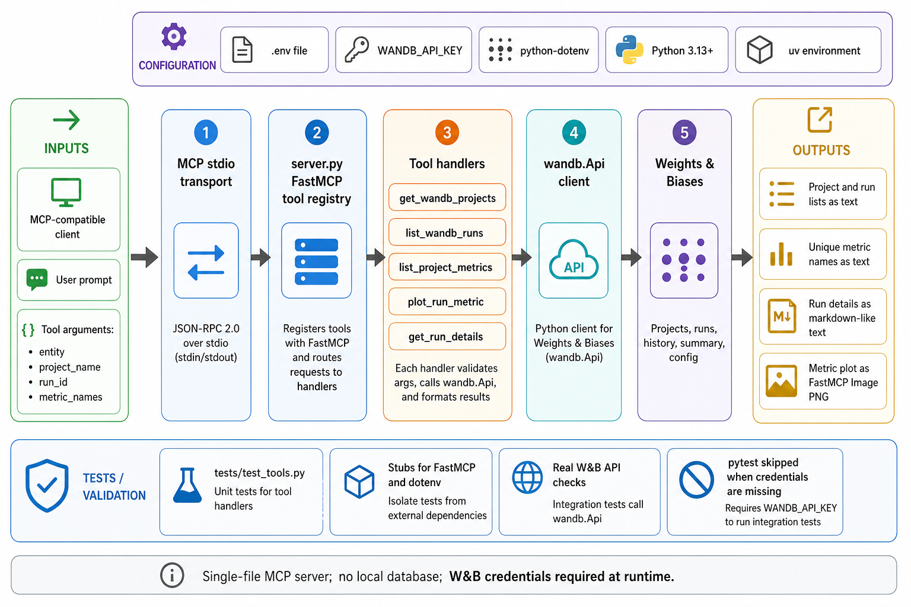

<p align="center">
  
  <br />
  <!-- repo-tagline:start -->
  <strong>🔬 Query Weights &amp; Biases experiments through MCP 📊</strong>
  <!-- repo-tagline:end -->
</p>

mcp-wandb is a small Model Context Protocol server for querying Weights & Biases from MCP-compatible clients. It exposes W&B projects, runs, metrics, run details, and metric plots as FastMCP tools over stdio.

Use it when you want an agent to inspect experiment data without switching to the W&B dashboard or hand-copying run metadata.

## Install

```bash
git clone https://github.com/tsilva/mcp-wandb.git
cd mcp-wandb
uv sync --locked --no-config --exclude-newer '7 days'
export WANDB_API_KEY=your_api_key
uv run python server.py
```

Configure your MCP client to run the repo's `server.py` file, then restart the client.

```json
{
  "mcpServers": {
    "wandb": {
      "command": "python",
      "args": ["/path/to/mcp-wandb/server.py"],
      "env": {
        "WANDB_API_KEY": "your_api_key"
      }
    }
  }
}
```

## Commands

```bash
uv sync --locked --no-config --exclude-newer '7 days'  # install the reviewed lockfile
uv run python server.py                                # run the MCP server over stdio
uv run pytest -q                                      # run offline mocked behavior tests
```

## Tools

- `get_wandb_projects(entity)` lists projects for a W&B entity.
- `list_wandb_runs(entity, project_name)` lists run names, IDs, and states.
- `list_project_metrics(entity, project_name)` returns metric names found across runs.
- `plot_run_metric(entity, project_name, run_id, metric_names)` returns a PNG metric plot as a FastMCP image.
- `get_run_details(entity, project_name, run_id)` returns overview, config, summary, and system metadata.

## Notes

- Python 3.13 or newer is required.
- `WANDB_API_KEY` must be set before invoking a W&B tool. MCP tool discovery and startup do not contact W&B.
- The server uses `wandb.Api` directly and does not keep a local database.
- Tests use mocked W&B responses, send no external requests, and exercise registration against the real MCP SDK.
- The MCP SDK is held on its patched 1.x line because MCP 2 removes the FastMCP module used by this server.

## Architecture



## License

[MIT](LICENSE)

CI uses repository-selected, SHA-pinned setup actions. When rotating a pin, replace the corresponding allowlist entry with the reviewed release commit while retaining the selected-only policy and SHA pinning.
